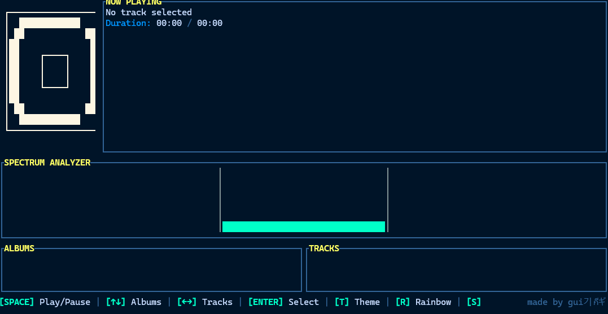

# 🎵 Rust Music Player

<div align="center">
  A beautiful and modern terminal music player with TUI interface!

</div>


## ✨ Features

- 🎨 **12 Visual Themes**: Dark, Light, Synthwave, Ocean, Forest, Cyberpunk, Neon, Retro, Sunset, Matrix, Arctic, Fire
- 📊 **FFT Spectrum Visualizer**: Real-time frequency analysis
- 🎧 **Album and Track Navigation**: Intuitive interface
- 🌈 **Rainbow Mode**: Colorful visual effects
- 🎹 **Keyboard Shortcuts**: Quick and easy controls

## ⌨️ KEYBOARD SHORTCUTS

| Key | Action |
|-----|--------|
| **SPACE** | Play/Pause |
| **↑ ↓** | Navigate Albums |
| **← →** | Navigate Tracks |
| **ENTER** | Select Track |
| **T** | Change Theme |
| **R** | Toggle Rainbow Mode |
| **S** | Show/Hide Shortcuts |
| **D** | Directory Selector |
| **CTRL+Q** | Quit |

## 🚀 How to Use

```bash
# Build
cargo build --release

# Run
cargo run --release
```

## 🎨 Available Themes

Press **T** to cycle through themes:
- **Dark**: Classic dark theme
- **Light**: Light theme
- **Synthwave**: Purple/cyan neon
- **Ocean**: Ocean blue tones
- **Forest**: Natural green
- **Cyberpunk**: Futuristic pink/cyan
- **Neon**: Black with neon
- **Retro**: Vintage orange tones
- **Sunset**: Sunset colors
- **Matrix**: Matrix green
- **Arctic**: Icy blue tones
- **Fire**: Orange/red

## 📦 Dependencies

- ratatui
- crossterm
- symphonia
- rubato
- cpal
- lofty
- rustfft
- tokio

---

**made by gui기กีギ**

---

*"하나님이 세상을 이처럼 사랑하사 독생자를 주셨으니 이는 그를 믿는 자마다 멸망하지 않고 영생을 얻게 하려 하심이라"*  
*"For God so loved the world that he gave his one and only Son, that whoever believes in him shall not perish but have eternal life."*  
*John 3:16*


